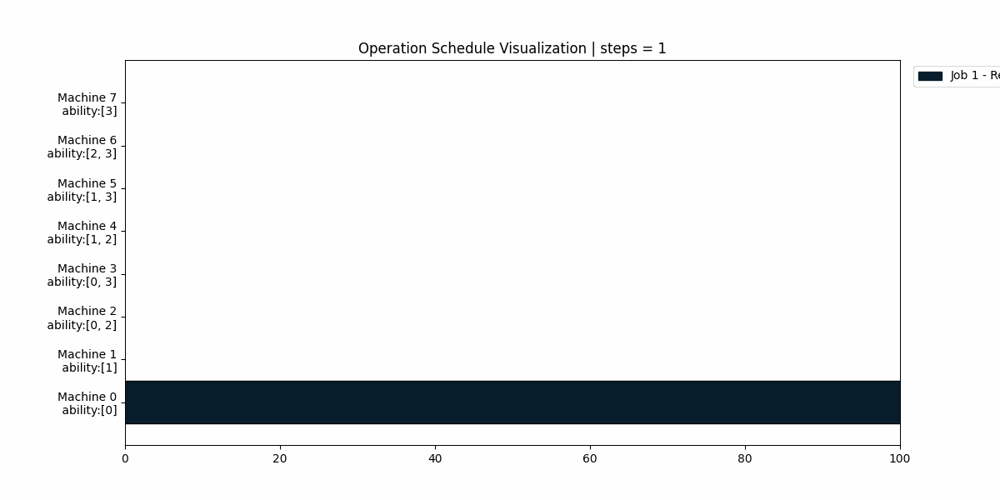

# RL-Scheduler: Reinforcement Learning for Repeatable Job Shop Scheduling

## Introduction

*An example of the proposed agent's scheduling process.*

RL-Scheduler is a project focused on applying Reinforcement Learning (RL) techniques to the complex problem of Repeatable Job Shop Scheduling. By modeling the scheduling environment as a custom Gym environment (RJSPEnv), we leverage state-of-the-art RL algorithms, specifically **MaskablePPO**, to learn efficient scheduling policies that can handle dynamic and complex job shop scenarios with invalid actions.

## Project Structure
~~~ bash
RL-Scheduler/
├── README.md
├── .gitignore
├── .pre-commit-config.yaml
├── poetry.lock
├── pyproject.toml
├── rl_scheduler
│   ├── RJSPEnv
│   │   ├── Env.py
│   │   ├── NoETDEnv.py
│   │   ├── Scheduler.py
│   │   ├── Scheduler_without_ETD.py
│   │   ├── __init__.py
│   ├── __init__.py
│   ├── instances
│   │   ├── Jobs
│   │       ├── v0-12x8-12.json
│   │       └── ...
│   │   └── Machines
│   │       ├── v0-12x8.json
│   │       └── ...
│   └── models
│       └── paper
│           ├── 0-paper-8x12-18m/
│              ├── MP_Single_Env4_gamma_1_obs_v4_clip_1_lr_custom_expv1_18000000.zip
│              └── ...
├── tutorial.ipynb
└── tests/
~~~
Project Structure Overview

- RJSPEnv/: Contains the environment (Env.py) and scheduler (Scheduler.py) code.
- instances/: Contains job and machine configuration files.
- models/: Pre-trained models and training logs.
- tests/: Contains test scripts used to validate project functionality

Additional files:

- tutorial.ipynb: Notebook demonstrating how to use the pre-trained model.
- .pre-commit-config.yaml: Configuration for pre-commit hooks, ensuring code quality by automatically formatting and checking code on commit
- poetry.lock: Lock file created by Poetry, specifying exact package versions to ensure consistent environments.
- pyproject.toml: The Poetry configuration file, which defines project dependencies and settings.
- README.md: Project documentation.

## Installation

### Prerequisites

- Python 3.11+ (as per your `pyproject.toml` configuration)
- Poetry package manager

### Install Required Packages

1. Install Poetry if you haven't already:
   - Follow the installation instructions for Poetry from the official [Poetry website](https://python-poetry.org/docs/#installation).

2. Create a virtual environment and install dependencies with Poetry:
   ```bash
   poetry install
   ```

3. Activate the virtual environment:
   ```bash
   poetry env activate
   ```

## How To Use

### Running the Tutorial

Follow the tutorial.ipynb notebook to learn how to load and test the pre-trained MaskablePPO model.

~~~bash
jupyter notebook tutorial.ipynb
~~~
This will guide you through the steps to load and evaluate the model within a custom reinforcement learning environment (RJSPEnv).

## Citation

~~~
@article{heo2024estimated,
  title={Estimated Tardiness-Based Reinforcement Learning Solution to Repeatable Job-Shop Scheduling Problems},
  author={Heo, Chi Yeong and Seo, Jun and Kim, Yonggang and Kim, Yohan and Kim, Taewoon},
  journal={Processes},
  volume={13},
  number={1},
  pages={62},
  year={2024},
  publisher={MDPI}
}
~~~